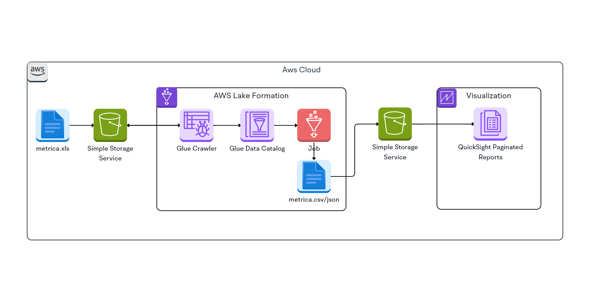

# Proyecto de Unidad II
## Almacen de datos con carga de datos automatizada para Zofratacna usando servicios de AWS

#### Estudiantes:
| Nombre y Apellido                    | Código      |
|--------------------------------------|-------------|
| Cano Sucso, Anthony Alexander        | 2020067573  |
| Chambilla Zuñiga, Josue Abraham      | 2020067575  |
| Jarro Jachi, Jose Luis               | 2020067148  |
| Rivera Mendoza, Jhonny               | 2020067144  |
| Valverde Zamora, Jean Pier Elias     | 2020066920  |

## Diagrama de arquitectura del proyecto:

